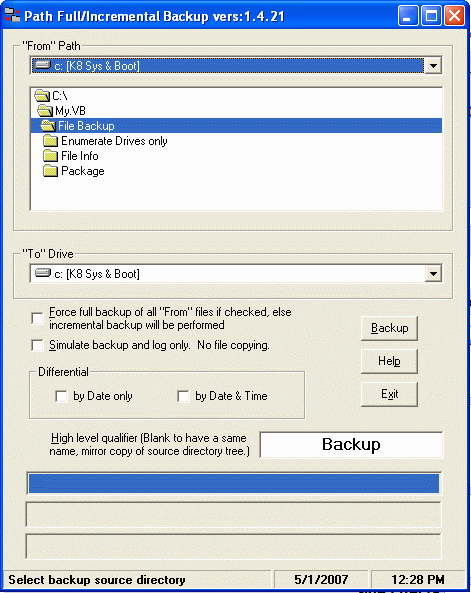

## A Folder &amp; Files Backup, Full, Incremental and Differential

### Description

This is a fully functional HD to HD Folder and Files backup either full or incremental. It is rather complete and debugged having been in daily use for a couple of months.

It was written to backup a NAS drive to a local HD so no problem with networked drives. It is meant for data files, not Windows or other system folders.

It has two passes, first it finds all files in the source directory, their changed date and size, then in the second pass, either copies all or only those changed after a the previous backup date (automatically updated to registry) to the target hard drive.

It will read CD/DVD does not write tape, DVDs or CDs. This is a HD to HD backup for data safety, only. It uses the File System Object for file and folder access (FSO is rather slow, sadly).

It has a command line interface so you can automate operation. There is also a help screen with additional information.

I would love to have it work in Shadow Copy mode but it seems very complex and I don't have the time to figure it out. Possibly someone can and I can integrate that function into the program for all to use.

The program logs most actions to a log file for review when it is run in command driven mode.

This code is a highly modified version of a source submission to Planet-Source-Code in 2003 named "diskscan" written by Manoz Shrivastava. My thanks to the author for posting a very good base for my use in creating this backup program.
 
### More Info
 

             |
---                |---
**Submitted On**   |2007-05-01 11:50:58
**By**             |[Mike Morrow](https://github.com/Planet-Source-Code/PSCIndex/blob/master/ByAuthor/mike-morrow.md)
**Level**          |Intermediate
**User Rating**    |5.0 (20 globes from 4 users)
**Compatibility**  |VB 6\.0
**Category**       |[Complete Applications](https://github.com/Planet-Source-Code/PSCIndex/blob/master/ByCategory/complete-applications__1-27.md)
**World**          |[Visual Basic](https://github.com/Planet-Source-Code/PSCIndex/blob/master/ByWorld/visual-basic.md)
**Archive File**   |[A\_Folder\_&206340512007\.zip](https://github.com/Planet-Source-Code/mike-morrow-a-folder-amp-files-backup-full-incremental-and-differential__1-67870/archive/master.zip)

